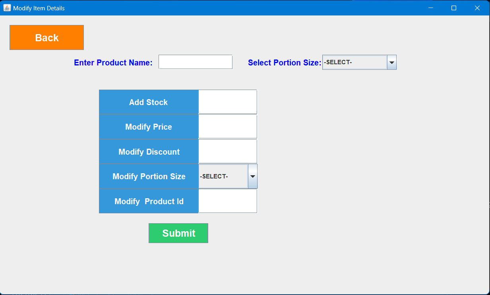
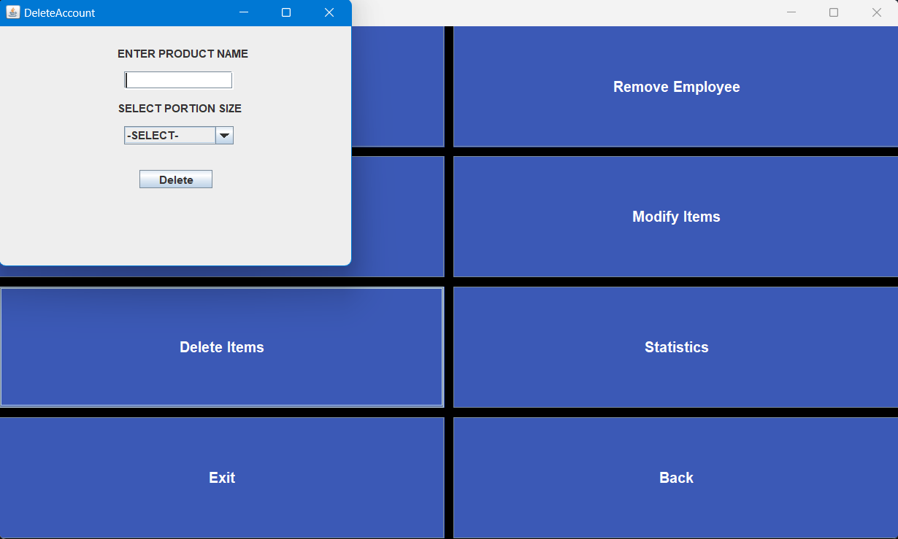

# Canteen Management System

## Project Overview
The **Canteen Management System** is a GUI-based desktop application built using Java, JDBC, MySQL, and Java Swing. It is designed to simplify and streamline canteen operations by providing two distinct modes: **Admin** and **Employee**. The Admin mode allows management of product details and employee records, while the Employee mode facilitates order placement and bill generation.

## Interface

| Login Panel | Admin Panel | Add Employee Panel | Delete Employee Panel |
|-------------|-------------|---------------------|-----------------------|
|  |  |  |  |

| Add Product Panel |  Modify Product Panel | Delete Product Panel | Statistics Panel of Admin |
|-------------------|------------------------------|----------------------|---------------------------|
|  |  |  |  |

| Employee Panel | Take Order Panel | Bill Panel | Statistics Panel of Employee |
|----------------|------------------|------------|------------------------------|
|  |  |  |  |

### Admin Mode
- **Product Management**: Add, delete, and modify product details (name, price, stock).
- **Employee Management**: Add or remove employees from the system.
- **Statistics**: View product statistics for better inventory tracking and management.

### Employee Mode
- **Order Placement**: Employees can place orders for canteen products.
- **Bill Generation**: Automatic bill generation for placed orders.
- **Statistics Viewing**: Employees can view basic statistics like order history and sales data.

---

## Features
- **Admin Panel**: Full control over canteen products and employees.
- **Employee Interface**: Simple and easy-to-use interface for order management.
- **Intuitive GUI**: Designed using Java Swing, providing a clean and user-friendly interface.
- **Data Persistence**: All data is stored in a MySQL database, ensuring secure and efficient data management.
- **JDBC Integration**: Seamless interaction between the Java application and MySQL database for CRUD operations.

---

## Technologies Used
- **Java**: Core programming language used for the application logic.
- **JDBC**: Java Database Connectivity for communication between the Java application and MySQL.
- **MySQL**: Database system used to store product, employee, and order information.
- **Java Swing**: GUI framework used to create the application’s interface.

---

## System Requirements
- **Java Development Kit (JDK)**: Version 8 or higher
- **MySQL**: Version 5.7 or higher
- **JDBC Connector**: MySQL JDBC Driver
- **IDE**: IntelliJ IDEA, Eclipse, or NetBeans (optional but recommended for development)

---

## Installation and Setup

1. **Clone the Repository**:
   ```bash
   git clone https://github.com/yourusername/canteen-management-system.git
   ```

4. **Configure the Database**:
   - Install MySQL.
   - Run the following SQL script to create the database and necessary tables:

     ```sql
     CREATE DATABASE CMSDATA;

     USE CMSDATA;

     CREATE TABLE STOCK (
         PRODUCT_ID INT PRIMARY KEY,
         PRODUCT_NAME VARCHAR(50),
         PORTION_SIZE VARCHAR(50),
         DISCOUNT INT,
         PRICE INT,
         TOTAL_QTY INT
     );

     CREATE TABLE CUSTOMER (
         FIRST_NAME VARCHAR(50),
         LAST_NAME VARCHAR(50),
         PHONE_NO BIGINT,
         TOTAL_AMOUNT INT,
         TOTAL_DISCOUNT INT,
         PAID_AMOUNT INT,
         DATE_OF_PURCHASE DATE DEFAULT (CURRENT_DATE)
     );

     CREATE TABLE PURCHASED (
         PRODUCT_NAME VARCHAR(50),
         PORTION_SIZE VARCHAR(50),
         DISCOUNT INT,
         PRICE INT,
         TOTAL_QTY INT
     );

     CREATE TABLE EMPLOYEES (
         ID INT PRIMARY KEY,
         FIRST_NAME VARCHAR(50),
         LAST_NAME VARCHAR(50),
         PHONE_NO BIGINT,
         EMAIL_ID VARCHAR(50),
         PASSWORD VARCHAR(50)
     );
     ```
   
3. **Add MySQL Connector**:
   - Download the MySQL JDBC Connector and add it to your project dependencies.
  
4. **Change the connectivity details**:
   - Navigate to `src/JDBC/JdbcConnectivity.java` and change the username and password according to your database configuration.
 

5. **Run the Application**:
   - Open the project in your IDE.
   - Run the `login.java` file to launch the application.

6. **Admin Mode Default Id and Password**:
   - id:123
   - password:Pass@123
   
---

## Database Schema

- **Product Table**: Contains product details such as name, price, and stock.
- **Employee Table**: Stores employee records.
- **Customer Table**: Records customer information, including contact details and purchase history.
- **Orders Table**: Records information about placed orders and bill generation.
- **Orders History Table (optional)**: Maintains a history of all past orders for comprehensive tracking of customer activity.

---

## Contact
For any inquiries or support, feel free to contact:
- **Name**: [Suraj Pandey]
- **Email**: [surajpandey7493@gmail.com]
- **GitHub**: [https://github.com/spsurajpandeysp](https://github.com/spsurajpandeysp)]
- **My Portfolio**: [https://github.com/spsurajpandeysp](https://surajpandey.vercel.app)]


🌟 **Thank You for Taking the Time to Explore Our Project!** 🌟
